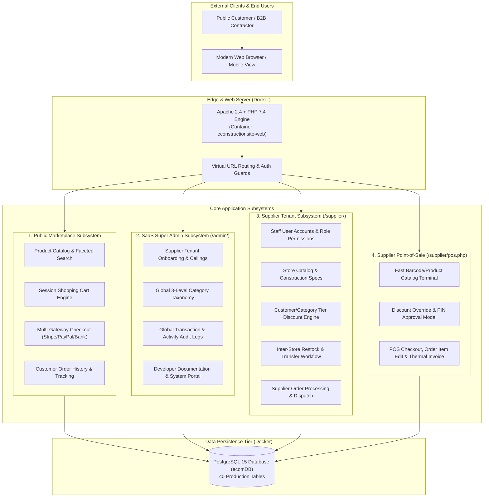

# System Architecture Map & Component Boundaries

```text
Status: Verified
Last Verified: 2026-09-08
Source: Architectural Inspection
Owner: eConstruction Supply Development Team
```



---

## Subsystem Boundary Definitions

1. **Public Marketplace**:
   - Primary domain for unauthenticated visitors and authenticated retail/wholesale customers.
   - Allows multi-supplier basket aggregation, calculating itemized shipping fees, and triggering third-party payment gateways.
2. **SaaS Super Administration**:
   - Restricted back-office portal accessible exclusively by platform administrators (`tbl_user`).
   - Configures platform commissions, store discount limits (ceilings), category trees, and monitors system-wide health.
3. **Supplier Multi-Tenant Platform**:
   - Private back-office portal partitioned strictly by `supplier_id`.
   - Accessible by registered tenant staff (`tbl_supplier_users`) with fine-grained RBAC roles.
4. **Supplier Point-of-Sale (POS)**:
   - Optimized high-speed desktop/tablet sales terminal designed for counter sales in brick-and-mortar builder yards.
   - Synchronizes directly with the store's central inventory pool and enforces supervisor discount authorizations.
