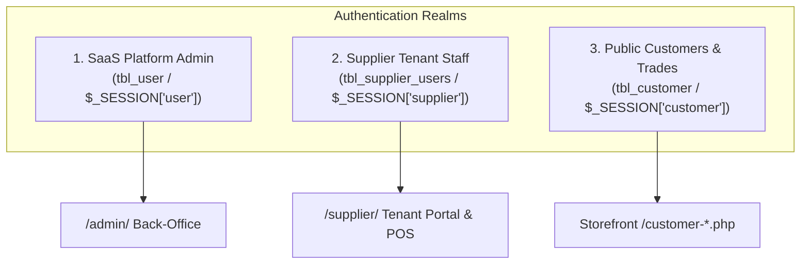

# User Roles & Identity Architecture

```text
Status: Verified
Last Verified: 2026-09-08
Source: Authentication Subsystem
Owner: eConstruction Supply Development Team
```

## 1. Authentication Partitioning

The platform implements 3 isolated authentication realms to ensure total security and privilege separation:



---

## 2. Supplier Staff Roles & Capabilities

Inside each supplier tenant (`tbl_supplier_users`), permissions are governed by normalized roles:

1. **Admin / Store Owner**:
   Full control over the supplier tenant: manages staff accounts, configures discount policies, oversees inventory, and views financial reports.
2. **Store Manager**:
   Oversees daily operations: approves cashier discount overrides, creates restock requisitions, manages catalog specifications, and fulfills orders.
3. **POS Cashier**:
   Dedicated counter sales operator: searches products, adds to POS cart, applies standard discounts up to threshold, and completes sales transactions.
4. **Order Processing Staff**:
   Fulfillment specialist: updates order shipment statuses, prints pick lists, and logs delivery tracking numbers.
5. **Store Incharge**:
   Depot supervisor: receives incoming restock shipments, audits physical inventory counts, and records stock adjustments.
