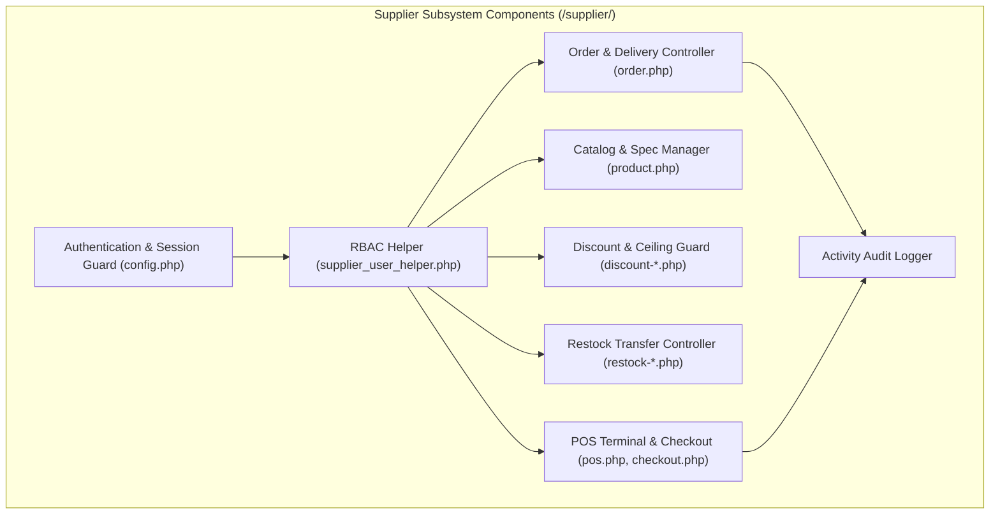

# C4 Level 3 - Component Diagrams

```text
Status: Verified
Last Verified: 2026-09-08
Owner: eConstruction Supply Development Team
```


```mermaid
flowchart TD
    subgraph SupplierSubsystem["Supplier Subsystem Components (/supplier/)"]
        AuthComp["Authentication & Session Guard (config.php)"]
        RBACComp["RBAC Helper (supplier_user_helper.php)"]
        CatalogComp["Catalog & Spec Manager (product.php)"]
        POSComp["POS Terminal & Checkout (pos.php, checkout.php)"]
        DiscountComp["Discount & Ceiling Guard (discount-*.php)"]
        RestockComp["Restock Transfer Controller (restock-*.php)"]
        OrderComp["Order & Delivery Controller (order.php)"]
        AuditComp["Activity Audit Logger"]
    end

    AuthComp --> RBACComp
    RBACComp --> POSComp
    RBACComp --> CatalogComp
    RBACComp --> DiscountComp
    RBACComp --> RestockComp
    RBACComp --> OrderComp
    OrderComp --> AuditComp
    POSComp --> AuditComp
```
