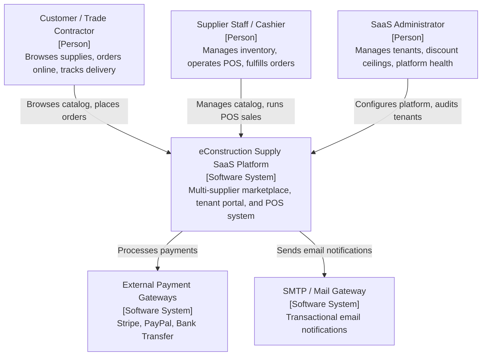

# C4 Level 1 - System Context Diagram

```text
Status: Verified
Last Verified: 2026-09-08
Source: C4 Architectural Model
Owner: eConstruction Supply Development Team
```


```mermaid
flowchart TD
    Customer["Customer / Trade Contractor\n[Person]\nBrowses supplies, orders online, tracks delivery"]
    SupplierUser["Supplier Staff / Cashier\n[Person]\nManages inventory, operates POS, fulfills orders"]
    SaaSAdmin["SaaS Administrator\n[Person]\nManages tenants, discount ceilings, platform health"]

    System["eConstruction Supply SaaS Platform\n[Software System]\nMulti-supplier marketplace, tenant portal, and POS system"]

    PaymentGateways["External Payment Gateways\n[Software System]\nStripe, PayPal, Bank Transfer"]
    EmailGateway["SMTP / Mail Gateway\n[Software System]\nTransactional email notifications"]

    Customer -->|Browses catalog, places orders| System
    SupplierUser -->|Manages catalog, runs POS sales| System
    SaaSAdmin -->|Configures platform, audits tenants| System

    System -->|Processes payments| PaymentGateways
    System -->|Sends email notifications| EmailGateway
```
