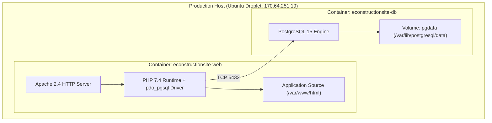

# Deployment & Container Architecture

```text
Status: Verified
Last Verified: 2026-09-08
Owner: eConstruction Supply Development Team
```

## Docker Container Architecture


```mermaid
flowchart TD
    subgraph Host["Production Host (Ubuntu Droplet: 170.64.251.19)"]
        subgraph WebContainer["Container: econstructionsite-web"]
            Apache["Apache 2.4 HTTP Server"]
            PHP["PHP 7.4 Runtime + pdo_pgsql Driver"]
            AppFiles["Application Source (/var/www/html)"]
        end

        subgraph DBContainer["Container: econstructionsite-db"]
            PG["PostgreSQL 15 Engine"]
            PGData["Volume: pgdata (/var/lib/postgresql/data)"]
        end
    end

    Apache --> PHP
    PHP --> AppFiles
    PHP -->|TCP 5432| PG
    PG --> PGData
```
