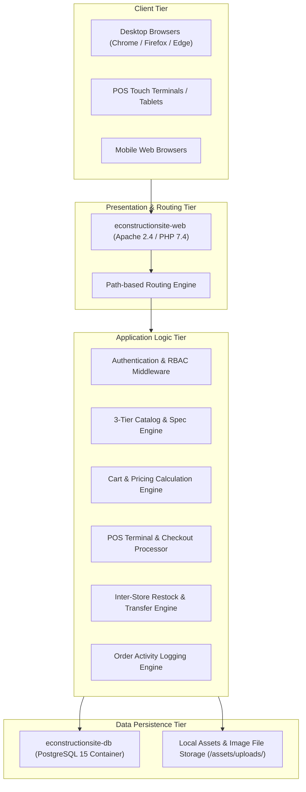

# High-Level System Architecture

```text
Status: Verified
Last Verified: 2026-09-08
Source: Docker & Infrastructure Audit
Owner: eConstruction Supply Development Team
```

## 1. Multi-Tier Application Architecture

The platform follows a modular Multi-Tier Web Architecture running in containerized Docker services:


