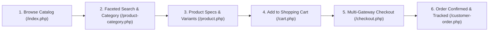

# Public Marketplace Subsystem Overview

```text
Status: Verified
Last Verified: 2026-09-08
Source: Source Code & Storefront Controllers
Owner: eConstruction Supply Development Team
```

## 1. Subsystem Architecture

The public marketplace allows prospective buyers (retail DIY consumers, residential developers, and trade contractors) to explore building materials, filter by category/brand, view live inventory levels, calculate shipping costs, and place orders via secure payment gateways.



---

## 2. Storefront Feature Specifications

### Feature: Product Catalog & Technical Specification Display
- **Purpose**: Present building supply items with rigorous construction specifications (material grade, load capacity, dimensions, durability standards).
- **Actors**: Public visitors, registered trade customers.
- **Preconditions**: Product must have `p_is_active = 1` and belong to an active supplier tenant (`tbl_supplier.status = 1`).
- **Database Entities**: `tbl_product`, `tbl_product_details`, `tbl_product_size`, `tbl_product_color`, `tbl_product_photo`.
- **Validation**: Ensures selected size and color combinations are active and quantity <= `p_qty`.
