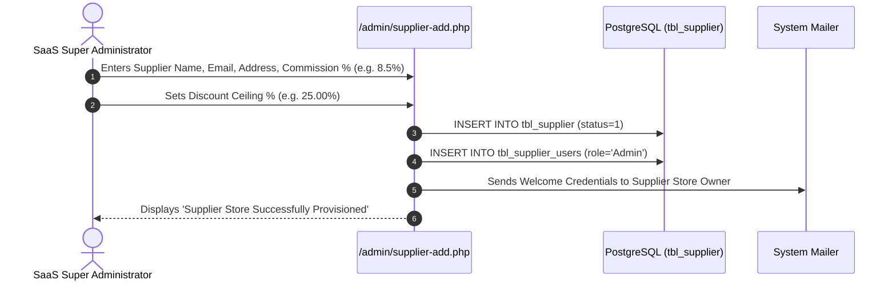

# Supplier Onboarding & Tenant Discount Ceilings

```text
Status: Verified
Last Verified: 2026-09-08
Source: /admin/supplier.php & /admin/supplier-edit.php
Owner: eConstruction Supply Development Team
```

## 1. SaaS Tenant Onboarding Workflow


