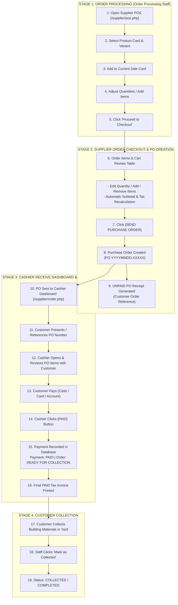

# POS Order Processing → Purchase Order → Cashier Payment Procedure

```text
Status: Verified Architectural Specification
Last Updated: 2026-09-08
Source: Production POS & PO Checkout Standard
Owner: eConstruction Supply Development Team
```

---

## 1. Objective & Architectural Boundaries

The platform separates:
1. **Order Preparation & PO Creation**: Conducted by **Order Processing Staff** via Supplier POS (`/supplier/pos.php`) and Order Checkout (`/supplier/checkout.php`).
2. **Purchase Order Submission & Unpaid Receipt Generation**: Produces a customer reference document (`Payment Status: UNPAID`, `Order Status: SENT TO CASHIER`).
3. **Cashier Reception & Payment Capture**: Conducted by **Cashier** via Receive Order Dashboard (`/supplier/order.php`), who accepts customer payment, clicks **"PAID"**, and generates the final **Payment Receipt** (`PAID`).
4. **Customer Collection**: Conducted in yard/depot after verifying payment.

---

## 2. End-to-End Workflow Diagram



---

## 3. Comparison: Purchase Order Receipt vs. Payment Receipt

| Attribute | Purchase Order Receipt (PO Reference) | Payment Receipt (Tax Invoice) |
| :--- | :--- | :--- |
| **Generated By** | Order Processing Staff on `[SEND PURCHASE ORDER]` | Cashier on `[PAID]` |
| **Payment Status** | **UNPAID** | **PAID** |
| **Order Status** | **SENT TO CASHIER / PENDING PAYMENT** | **READY FOR COLLECTION / COMPLETED** |
| **Document Purpose**| Customer reference to present at cashier trade counter | Proof of legal financial settlement |
| **Collection Eligibility**| ❌ Cannot collect goods with this document alone | ✓ Authorized for yard release |

---

## 4. Critical Business Rules

1. **BR-PO-001 (Staff Role Limitation)**: Order Processing Staff creates and submits the PO, but is strictly prohibited from accepting customer funds or clicking "PAID".
2. **BR-PO-002 (PO Sent != Paid)**: Submitting a Purchase Order does NOT record payment or decrement financial receivables.
3. **BR-PO-003 (Cashier Payment Authority)**: Only Cashiers, Managers, and Admins can record payments.
4. **BR-PO-004 (Duplicate Payment Prevention)**: Once a PO is marked PAID, subsequent payment calls are rejected.
5. **BR-PO-005 (Premature Collection Prevention)**: Unpaid POs cannot be marked as COLLECTED.
6. **BR-PO-006 (Checkout In-Place Editing)**: Quantities, removals, and additions during checkout review dynamically recalculate subtotals, taxes, and grand totals.
7. **BR-PO-007 (Tenant Data Scoping)**: All POs, payments, and staff actions enforce `WHERE supplier_id = ?`.
