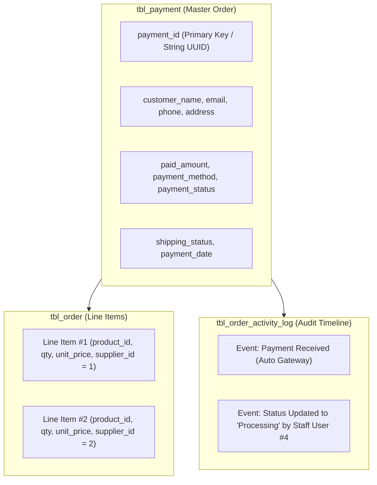

# Order Management Architecture & Lifecycle

```text
Status: Verified
Last Verified: 2026-09-08
Source: /admin/order.php, /supplier/order.php, checkout.php
Owner: eConstruction Supply Development Team
```

## 1. Relational Order Architecture

The order subsystem operates across two primary tables:

1. **`tbl_payment` (Master Transaction Record)**:
   - Contains customer identification (`customer_id`, `customer_name`, `customer_email`).
   - Contains payment details (`payment_id`, `payment_method`, `paid_amount`, `payment_status`).
   - Contains delivery and fulfillment status (`shipping_status`, `payment_date`).
   - For multi-supplier orders, `supplier_id` stores the primary or aggregated tenant.

2. **`tbl_order` (Itemized Order Line Items)**:
   - Contains specific product lines (`product_id`, `product_name`, `size`, `color`, `quantity`, `unit_price`).
   - Tied to master transaction via `payment_id`.
   - Scoped to individual supplier stores via `supplier_id` for tenant-level fulfillment.


