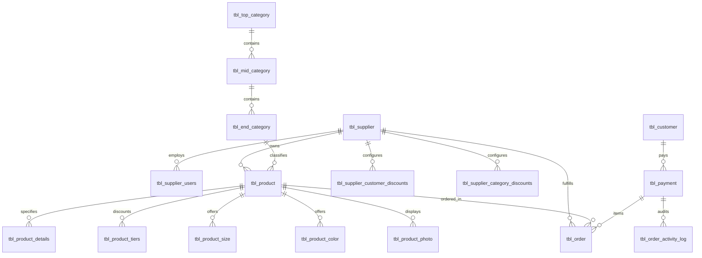

# Database Entity Relationship Diagram (ERD)

```text
Status: Verified
Last Verified: 2026-09-08
Owner: eConstruction Supply Development Team
```


```mermaid
erDiagram
    tbl_supplier ||--o{ tbl_supplier_users : employs
    tbl_supplier ||--o{ tbl_product : owns
    tbl_supplier ||--o{ tbl_supplier_customer_discounts : configures
    tbl_supplier ||--o{ tbl_supplier_category_discounts : configures
    tbl_supplier ||--o{ tbl_order : fulfills

    tbl_top_category ||--o{ tbl_mid_category : contains
    tbl_mid_category ||--o{ tbl_end_category : contains
    tbl_end_category ||--o{ tbl_product : classifies

    tbl_product ||--o{ tbl_product_details : specifies
    tbl_product ||--o{ tbl_product_tiers : discounts
    tbl_product ||--o{ tbl_product_size : offers
    tbl_product ||--o{ tbl_product_color : offers
    tbl_product ||--o{ tbl_product_photo : displays
    tbl_product ||--o{ tbl_order : ordered_in

    tbl_customer ||--o{ tbl_payment : pays
    tbl_payment ||--o{ tbl_order : items
    tbl_payment ||--o{ tbl_order_activity_log : audits
```
