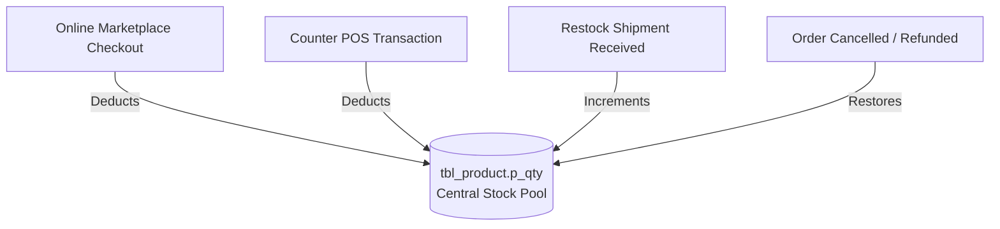

# Inventory Management & Stock Movement Architecture

```text
Status: Verified
Last Verified: 2026-09-08
Source: PostgreSQL Schema & Order Flow
Owner: eConstruction Supply Development Team
```

## 1. Central Inventory Architecture

- **Stock Balance**: Stored in `tbl_product.p_qty` as an integer.
- **Single Pool Synchronization**: Both online storefront orders and counter POS sales directly decrement this central column.
- **Restock Requests**: Managed across 4 tables (`tbl_restock_request`, `tbl_restock_request_items`, `tbl_restock_shipment`, `tbl_restock_transfer_history`) to support multi-branch transfers.


