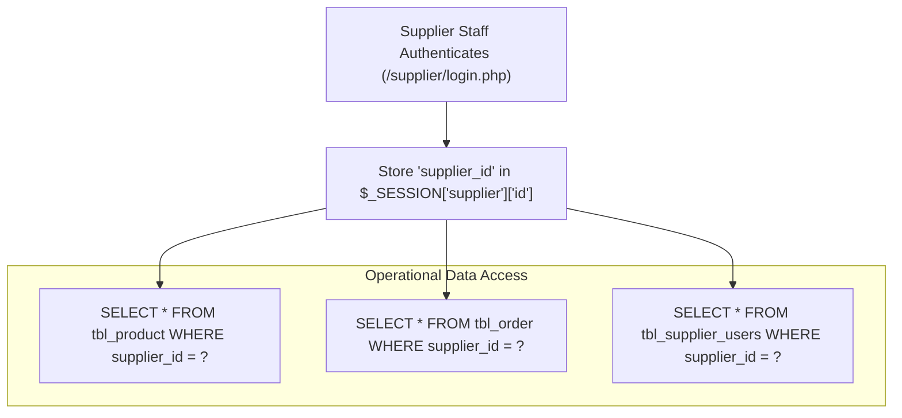

# Multi-Tenant Data Isolation & Security

```text
Status: Verified
Last Verified: 2026-09-08
Source: Source Code & SQL Query Analysis
Owner: eConstruction Supply Development Team
```

## 1. Tenant Isolation Architecture

The platform isolates multi-tenant operational data using **Logical Column Partitioning**:



---

## 2. Tenant Boundary Rules & Verification

1. **Product Isolation**:
   Suppliers can only view, edit, or delete catalog items with their matching `supplier_id`.
2. **Order Isolation**:
   In `/supplier/order.php`, order records are joined on `tbl_order.supplier_id = $_SESSION['supplier']['id']`.
3. **Staff Isolation**:
   A supplier administrator can only list and modify staff users sharing their own `supplier_id`.
4. **Cross-Tenant Access Prevention**:
   Direct parameter tampering (e.g., passing `?id=99` belonging to another supplier) is blocked by checking `supplier_id = ?` in the update query.
